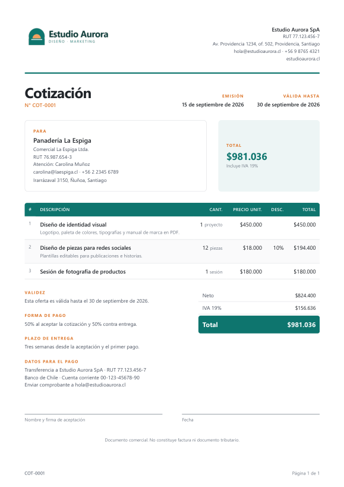
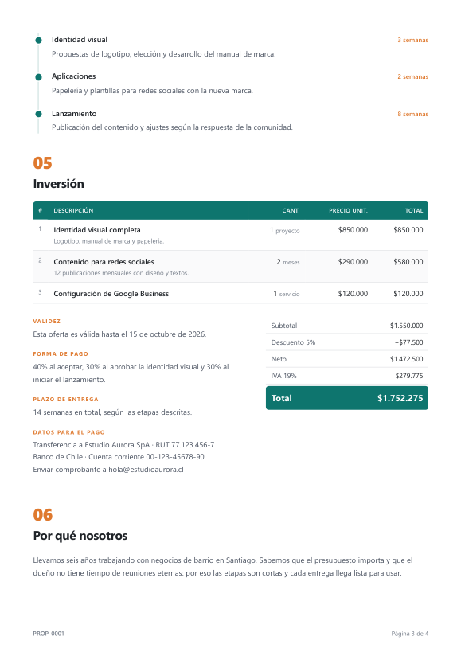

# Cotizaciones y propuestas con tu marca

Un asistente que arma tus cotizaciones y propuestas **conversando contigo**. Le cuentas a quién
le vas a cotizar y qué, y te entrega el documento listo en **PDF, Word y Excel**, con tu nombre,
tu logo y tus colores.

No necesitas saber de tecnología. No hay que llenar planillas ni aprender un programa.

<p align="center">
  
  
  
</p>

---

## Lo que necesitas

- **Un computador** con Windows o Mac. Desde el celular no se puede.
- **Una cuenta de Claude de pago.** El plan más básico cuesta alrededor de 20 dólares al mes;
  revisa el precio actual en [claude.ai](https://claude.ai). La cuenta gratuita no incluye esta
  función.
- **La aplicación de Claude** para computador, desde [claude.ai/download](https://claude.ai/download).

Nada más. Si falta algo, el asistente lo instala y te pide permiso antes.

---

## Cómo empezar — la primera vez

**1. Descarga la carpeta.** En esta misma página de GitHub, arriba de la lista de archivos, hay
un botón verde que dice **Code**. Haz clic y después en **Download ZIP**. Se descarga un archivo
en tu carpeta *Descargas*.

**2. Sácala del ZIP.**
- **Windows:** en *Descargas*, clic derecho sobre el archivo → **Extraer todo** → **Extraer**.
- **Mac:** doble clic sobre el archivo.

> ⚠️ **Ojo con esto:** al extraer queda **una carpeta dentro de otra con el mismo nombre**. La
> que sirve es **la de adentro**: la que tiene las carpetas `generador` y `ejemplos`. Si quieres,
> muévela a *Documentos* para tenerla a mano.

**3. Abre la aplicación de Claude** y arriba elige **Code**. (Es otra cosa distinta al botón
verde de GitHub, aunque se llamen igual.)

**4. Elige la carpeta de adentro** del paso 2.

**5. Si te pregunta si confías en la carpeta, di que sí.**

**6. Escribe `/cotizar` y presiona Enter.** En un teclado en español, la barra `/` se escribe con
**Shift + 7**.

> **¿No aparece `/cotizar`?** Casi siempre es porque elegiste la carpeta de afuera. Vuelve al
> paso 4 y elige la de adentro.

La primera vez, el asistente deja listo lo necesario y te pide **tres datos de tu negocio**.
Después ya puedes cotizar.

> **Sobre los permisos:** Claude te va a pedir autorización antes de hacer cosas en tu
> computador, como instalar lo necesario o crear los archivos. Es normal: aprieta el botón para
> permitir. Si la primera vez la aplicación te pide instalar algo más, también acepta.

---

## Cómo se usa — todas las demás veces

Abre Claude, entra a **Code**, elige la misma carpeta y escribe **`/cotizar`**. Después dile lo
que necesitas, con tus palabras:

- *"Cotización para la señora Rosa: cambio de tablero eléctrico 180 mil, y 6 enchufes instalados
  a 25 mil cada uno."*
- *"Hazme una cotización para la panadería La Espiga: un logo a 450 mil y 12 piezas para redes a
  18 mil cada una."*
- *"Arma una propuesta para la clínica veterinaria."*
- *"Cambia el precio de los enchufes en la cotización de la señora Rosa."*

Te hace las preguntas que falten, te muestra los totales, y cuando le dices que está bien, crea
los archivos.

> **Si prefieres hablar en vez de escribir:** en Windows aprieta **tecla Windows + H** y dicta.
> En Mac, aprieta dos veces la tecla **fn**.

Puedes parar cuando quieras: si algo queda a medias, la próxima vez te ofrece retomarlo.

---

## Tus documentos

Quedan dentro de la carpeta que elegiste, en **`mis-documentos`**, cada uno con su número y el
nombre del cliente:

```
mis-documentos/
  COT-0001 Señora Rosa/
    COT-0001 Señora Rosa.pdf      ← este es el que le mandas al cliente
    COT-0001 Señora Rosa.docx
    COT-0001 Señora Rosa.xlsx
```

**Al cliente se le manda el PDF.** El Word y el Excel son por si te los piden.

Los números de cotización son correlativos y **nunca se repiten**.

### Mandarla por WhatsApp desde el computador

1. En el computador, abre **web.whatsapp.com**.
2. En tu celular: WhatsApp → los tres puntos (en iPhone, Configuración) → **Dispositivos
   vinculados** → **Vincular un dispositivo**, y apunta la cámara al código de la pantalla.
3. Abre el chat del cliente y **arrastra el PDF** a la conversación.

Se hace una vez; después queda vinculado. Si te complica, pídele ayuda al asistente.

---

## Lo que tienes que saber

**Una cotización no es una factura.** Los documentos lo dicen al pie. La factura o boleta la
sigues haciendo donde siempre.

**Revisa antes de enviar.** El asistente no se equivoca en las sumas, pero el precio que le
dictaste y los datos del cliente tienen que estar bien de tu lado.

**El impuesto.** El asistente te pregunta cómo das tus precios. Si no sabes si te corresponde
cobrar impuesto, deja tus precios tal cual y confírmalo con tu contador: después se cambia en un
minuto.

**Tus documentos quedan en tu computador.** Lo que le cuentas al asistente pasa por Claude, como
cualquier conversación con Claude.

---

## Preguntas frecuentes

**¿Puedo agregar mi logo o cambiar los colores?**
Sí. Después de tu primera cotización te lo ofrece, y en cualquier momento puedes decirle
*"quiero poner mi logo"*.

**¿Puedo editar el Word o el Excel?**
Sí, son archivos normales. En el Excel, si cambias una cantidad o un precio, los totales se
recalculan solos. Pero el PDF no se entera: si quieres que los tres coincidan, pídele el cambio
al asistente y te rehace los tres.

**¿Funciona en mi país?**
Trae los valores de 18 países de habla hispana. Si el tuyo no está, igual funciona: te pregunta
la moneda.

**¿Qué diferencia hay entre una cotización y una propuesta?**
La cotización es la lista de precios y condiciones. La propuesta además explica el proyecto: qué
necesita el cliente, qué incluye y qué no, y en qué etapas se hace.

**¿Cuánto cuesta?**
El asistente es gratis. Lo que se paga es tu cuenta de Claude.

---

<details>
<summary><strong>Para desarrolladores</strong></summary>

### Cómo funciona

```
.claude/skills/cotizar/     El agente: conversación, reglas y formato de datos
generador/
  generar.py                Punto de entrada que usa el agente
  calculos.py               Montos con Decimal y redondeo igual al ROUND de Excel
  contenido.py              Una sola vista de datos para los tres formatos
  datos.py                  Validación y seguridad de la entrada
  pdf.py                    HTML con escape automático + Chrome/Edge headless
  word.py                   python-docx
  excel.py                  XlsxWriter: fórmulas con el valor ya calculado guardado
  plantillas/               HTML y CSS del PDF
  paises.json               Moneda, impuesto e identificación tributaria por país
ejemplos/                   Negocio, cotización y propuesta de ejemplo
tests/                      Pruebas
```

El agente conversa y escribe los datos; **nunca calcula montos**. Los tres formatos salen de la
misma vista calculada, así que no pueden mostrar totales distintos.

La skill vive en `.claude/skills/` de la carpeta, así que Claude Code la carga al abrirla, sin
copiar nada a la configuración del usuario.

### Decisiones de seguridad

- Todo texto del usuario pasa por escape automático antes de llegar al HTML del PDF.
- Los colores se validan como `#rrggbb` estricto: se insertan en CSS, donde el escape de HTML no
  protege.
- En Excel, el texto se escribe siempre como texto: una celda que empieza con `=`, `+`, `-` o `@`
  nunca se convierte en fórmula.
- Logos solo PNG o JPG, verificados por su contenido y no por la extensión. Los SVG pueden traer
  código.
- Los nombres de archivo se limpian de rutas y nombres reservados de Windows.
- `mi-negocio/` y `mis-documentos/` están en `.gitignore`: si alguien sube su copia a GitHub, sus
  datos y los de sus clientes quedan fuera.

### Pruebas

```bash
python generador/preparar.py
.venv/Scripts/python -m pip install -r tests/requirements.txt    # en Mac: .venv/bin/python
cd tests
../.venv/Scripts/python -m unittest
```

`test_excel_real.py` abre cada Excel con Microsoft Excel, fuerza el recálculo de todas las
fórmulas y compara contra el valor guardado. Solo corre en Windows con Excel instalado.

</details>

---

Desarrollado por [SICS](https://alvarocofre.dev)
